[](https://lumen-mmjq.onrender.com/)
> A movie recommendation engine with a Flask API, JWT auth, and Bayesian scoring against the IMDb dataset.

[](https://github.com/bugra-ozer/lumen/actions/workflows/ci.yml)


---

## What is it?

Lumen is an intelligent movie engine that filters through thousands of titles to deliver tailored suggestions, built on the public IMDb dataset, with poster artwork resolved live per recommendation via the TMDb API.

Under the hood, ratings are evaluated with a Bayesian averaging algorithm — the same methodology IMDb's own Top 250 uses, a well-supported 8.5 rated movie outranks a 9.0 backed by a handful of votes. See **Bayesian Scoring** below for the full formula.

The engine is served through a Flask REST API with JWT authentication, queryable by genre and rating per request, with a lightweight web frontend and a CLI for local use.

Deployed and usable at: [Lumen](https://lumen-mmjq.onrender.com/)

---

## Architecture



---

## Tech Stack
 
| Layer           | Technology                                                   |
|-----------------|--------------------------------------------------------------|
| Language        | Python 3.10+, HTML, CSS, JS                                  |
| API             | Flask 3.1+                                                   |
| Database Tools  | psycopg2-binary, Flask-SQLAlchemy, SQLAlchemy                |
| Database Deploy | PostgreSQL (Neon in production, Docker locally)              |
| Data processing | Pandas, NumPy                                                |
| Dataset         | IMDB public TSV datasets                                     |
| Posters         | TMDb API                                                     |
| Authentication  | PyJWT, bcrypt                                                |
| Config          | python-dotenv                                                |
| Deployment      | Render (web service), Gunicorn WSGI                          |

---

## Frontend

A minimal web interface is served directly by Flask (`api/static/`) — no framework, plain HTML/CSS/JS. Register or log in, pick genres and a rating range, and browse recommendations as a poster grid.

- Genre filters are multi-select
- Rating filters support a minimum, a maximum, or a full range
- Posters are fetched live per recommendation via TMDb (see below), with a fallback placeholder when no match is found

---
 
## API Endpoints
 
- `POST /login` — Returns JWT access token + refresh token.
- `POST /register` — Returns status and inserts user to dB.
- `POST /refresh` — Exchanges refresh token for new access token.
- `POST /logout` — Returns status and deletes the refresh token.
- `POST /recommendations` — Returns scored, filtered movie list *(protected)*. Accepts filter parameters genre, rating range/operators. 
- `GET /health` — Service health check.
All protected routes require `Authorization: Bearer <token>`.
 
---

## Auth Design

Three-layer security stack:

- **bcrypt** (cost factor 12) — password hashing.
- **JWT (HS256)** — self-verifying signed access tokens, 15-minute expiry, no DB lookup required per request
- **secrets.token_hex** — cryptographically random refresh tokens, 30-day expiry, server-side dictionary lookup

---

## Bayesian Scoring

Standard weighted rating formula:

$$Score = \left(\frac{v}{v + m}\right) r + \left(\frac{m}{v + m}\right) c$$

Where `v` = vote count, `m` = minimum votes threshold, `r` = movie average, `c` = global average. Scores are computed once at startup across the full dataset and held in memory.

#### Decay Factor
 
A time-based penalty is applied to account for a movie's age, ensuring older titles don't compete on equal footing with newer releases when recency matters.
 
$$\text{decay factor} = f^{\,\text{years old}}$$

Where `f` is a decay base constant between `0` and `1` (e.g. `0.997`), and `years_old` is the number of full years since the movie's release year. A value close to `1` applies only a mild penalty.

#### Adjusted Score
 
The final ranking score combines the Bayesian rating with the decay factor:
 
$$\text{adjusted score} = \text{decay factor} \times \text{bayesian score}$$
 
This preserves the robustness of the Bayesian estimate while introducing a mild recency bias. Like the base score, adjusted scores are computed once at startup and held in memory alongside their components.


---

## Getting Started
Use at: [Lumen](https://lumen-mmjq.onrender.com/) OR
```bash
## Requirements
- Python 3.10+
- Docker Desktop

## Running

# Clone the repo
git clone https://github.com/bugra-ozer/lumen
cd lumen

# Install dependencies
pip install -r requirements.txt

# Set environment variables
cp .env.example .env  # fill in SECRET_KEY, DATABASE_URL, and TMDB_ACCESS_TOKEN

# Start PostgreSQL
docker-compose up -d

# Run the API
python api/api.py

# Or run the CLI
python main.py
```

## Author

**Bugra Ozer** — [github.com/bugra-ozer](https://github.com/bugra-ozer)
